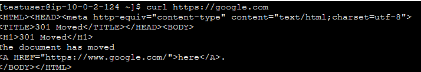

# Deploy VPC 

This directory contains the needed configuration files for the VPC deployment module (network), which contains 1 VPC, 2 private subnets, 2 private subnets, an internet gateway and a NAT gateway.
The 2 private subnets connect to the NAT gateway, which is connected to the two public subnets. The 2 public subnets are connected to the internet gateway.
All the necessary routing configurations are defined there as well. 
With the "aws_vpc_endpoint" resource a connection is made between the VPC and the S3 service. 

## Network configuration diagram

## Tests

I created a small EC2 instance, which is connected to one of the private subnets. I tried to connect to google.com and chemaxon.com and was successful
### EC2 instance details
*It is in the private-subnet-development-2 and doesn't have public IPv4 address.*

### Test connection to google.com

### Test connection to chemaxon.com
*The response was too long to make a screenshot.*

